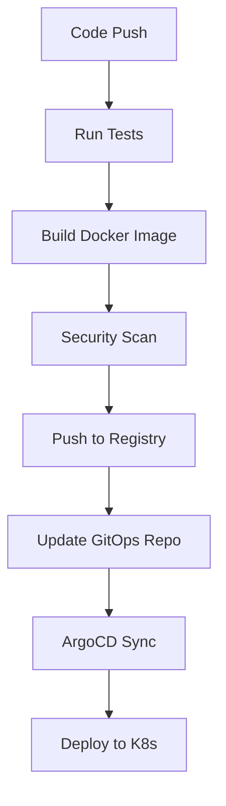

# 🛠️ Tech Stack
## Infrastructure

Kubernetes + (EKS)
Terraform (IaC)
AWS (Cloud Provider)

## CI/CD & GitOps

GitHub Actions
ArgoCD
Kustomize
Helm

## Observability

Prometheus (metrics)
Grafana (dashboards)
Loki (logs)
Alertmanager (alerts)

## Security

Sealed Secrets
Network Policies
RBAC
Pod Security Standards

🚦 Quick Start
Prerequisites

# Required tools
- kubectl 1.28+
- helm 3.12+
- terraform 1.5+
- docker 24.0+
- aws-cli 2.0+
- argocd CLI

# Setup

# Initialize Terraform
cd terraform/environments/dev
terraform init

# Plan infrastructure
terraform plan -out=tfplan

# Apply infrastructure
terraform apply tfplan

# Configure kubectl
aws eks update-kubeconfig --region us-east-1 --name cloudtrade-dev

# Deploy Monitoring Stack

./scripts/setup-monitoring.sh

# Access Grafana
kubectl port-forward -n monitoring svc/prometheus-grafana 3000:80
# Open http://localhost:3000

Install ArgoCD

cd gitops/argocd
./install.sh

# Deploy applications
kubectl apply -f app-of-apps.yaml

# Access ArgoCD UI
kubectl port-forward svc/argocd-server -n argocd 8080:443
# Open https://localhost:8080

# Deploy Applications
# Using Kustomize directly
kubectl apply -k kubernetes/overlays/dev

# Or let ArgoCD handle it
argocd app sync cloudtrade-apps

🔄 CI/CD Pipeline
Workflow

Deployment Strategy

Dev: Auto-deploy on push to develop
Staging: Auto-deploy on push to main (requires approval)
Production: Manual approval + canary deployment

📈 Monitoring & Observability
Grafana Dashboards
Access pre-configured dashboards:

kubectl port-forward -n monitoring svc/prometheus-grafana 3000:80

Available Dashboards:

Kubernetes Cluster Overview
Application Metrics (RED)
Node Exporter
PostgreSQL Performance
Custom Trading Metrics

Alerting
Configured alerts in kubernetes/monitoring/prometheus/alerting-rules.yaml:

High error rate (>5%)
High latency (P95 >1s)
Pod restart loops
Memory/CPU pressure
Database connection pool exhaustion

🔐 Security
Implemented Security Measures
✅ Pod Security

Read-only root filesystem
Non-root user execution
Dropped capabilities
Security context constraints

✅ Network Security

Network policies (default deny)
Service-to-service encryption
Ingress TLS termination

✅ Secrets Management

Sealed Secrets for GitOps
External Secrets Operator (optional)
IRSA for AWS credentials

✅ RBAC

Least privilege service accounts
Role-based access control
Namespace isolation

📊 Key Features Demonstrated
CKAD Concepts

 Multi-container pods (sidecar, init containers)
 Resource requests & limits
 Liveness, readiness, startup probes
 ConfigMaps & Secrets
 Persistent volumes (StatefulSets)
 Services & Ingress
 Network policies
 Jobs & CronJobs
 HorizontalPodAutoscaler
 Pod disruption budgets

DevOps Best Practices

 Infrastructure as Code (Terraform)
 GitOps workflow (ArgoCD)
 Multi-environment strategy
 Automated testing & security scanning
 Blue-green & canary deployments
 Comprehensive monitoring
 Centralized logging
 Disaster recovery & backups

🧪 Testing
Run Tests Locally
# Unit tests
cd apps/trading-api
npm test

# Integration tests
npm run test:integration

# Load testing
cd tests/load
k6 run load-test.js

CI Testing
All PRs automatically run:

Unit tests
Integration tests
Linting
Security scanning (Trivy)
Container image scanning

📚 Documentation

Architecture Details
Deployment Guide
Monitoring Guide
Troubleshooting
Development Guide

🤝 Contributing
Contributions are welcome! Please read our Contributing Guide.
📝 License
This project is licensed under the MIT License - see LICENSE file.
🎓 Learning Resources
Built as a portfolio project demonstrating:

CKAD certification knowledge
Production Kubernetes deployments
Cloud-native DevOps practices
Modern CI/CD pipelines

